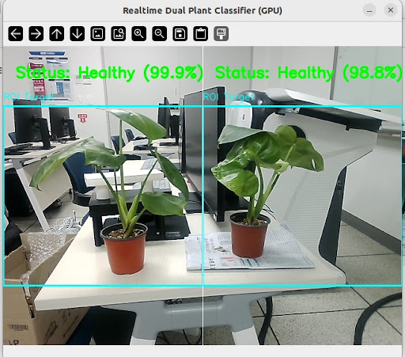

# Plant-Health-Edge-AI
# 🌿 Dual-ROI Real-time Plant Health Classifier for Edge AI
<p align="center">
  
</p>

**Jetson Orin Nano와 YOLOv8을 활용한 식물 상태 실시간 모니터링 시스템**

이 프로젝트는 딥러닝 기반의 이미지 분류 모델을 활용하여 식물의 건강 상태(Healthy/Wilted)를 실시간으로 판별합니다. 특히 단일 카메라 프레임을 두 개의 ROI(Region of Interest)로 분할하여 다수의 객체를 독립적으로 분석하며, Jetson Orin Nano와 같은 엣지 디바이스에 최적화하여 구현되었습니다.

---

## 🚀 Key Features
- **Multi-Target Analysis:** 프레임을 좌우로 분할하여 두 개의 식물을 동시에 실시간 모니터링 및 개별 상태 판별.
- **Edge AI Optimization:** PyTorch 기반 YOLOv8 모델을 Jetson Orin Nano의 GPU(CUDA) 가속을 활용해 실시간 추론 달성.
- **Visual Feedback:** 분석 결과에 따라 상태 메시지와 시각적 가이드(박스 및 텍스트)를 GUI에 실시간 표출.

---

## 🛠 Tech Stack
- **Language:** Python 3.x
- **Frameworks:** PyTorch, Ultralytics (YOLOv8), CUDA
- **Acceleration Engines: NVIDIA CUDA & TensorRT
- **Computer Vision:** OpenCV
- **Hardware:** NVIDIA Jetson Orin Nano, CSI/USB Camera
- **Operating System: Linux (Ubuntu 20.04/22.04 LTS), NVIDIA JetPack SDK
- **Tools:** GitHub

---

## 📁 Project Structure

- `YOLOv8TrainCLS.py`: 모델 학습 메인 스크립트
- `training_config.py`: 하이퍼파라미터 및 학습 설정 파일
- `test 100.py`: 젯슨 올인 나노 실시간 추론 및 Dual-ROI 구현 코드

---

## 📊 Dataset & Training Strategy
- **Classes:** `Healthy` (건강), `Wilted` (시듦)
- **Problem Solving:** - 특정 클래스의 인식 저하 문제를 해결하기 위해 외부 포털에서 고품질 데이터를 선별적으로 확보.
- **Training Environment:** PyTorch 기반의 YOLOv8 Nano(Classify) 모델 활용.

- ---

## 🚀 Quick Start (Jetson Nano)

이 프로젝트를 실행하기 위한 최소한의 설치 및 실행 방법입니다.

1. **Environment Setup:**
   ```bash
   pip install ultralytics opencv-python torch torchvision

# 카메라가 연결된 상태에서 실행
    python "test 100.py"  
---

